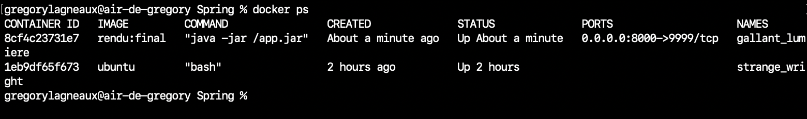

# Springboot application containerized with Docker


# Universal documentation of the project
## Setup :
to get the project : ```git clone https://github.com/AElolz-FH/Spring```
```cd spring```

Ensure that you are in the ```Spring``` directory (parent folder) to be able to run the commands below (you need to have docker installed).
The Dockerfile must be in the ```Spring``` folder to run the commands below

### Install docker
https://www.docker.com/products/docker-desktop/

## Get the image with the dockerfile
```docker build -t rendu:final .```

## Run the container
```docker run -d -p 8000:9999 -v {absolute path of the local data}:/app/data rendu:final```
this folder in absolute path is located in : ```src/main/java/docker/TP/Controller```

the 9999 port is the port exposed in the container and 8000 is the port exposed on the host.

## Test the app with postman or navigator : 

Enpoints :
- ```http://localhost:8000/api/sha256?input=test``` for sha256 algorithm
alternative alogorithm :
- ```http://localhost:8000/api/shaMD5?input=test``` for MD5 algorithm

the input can be parameterized in the url after the ```?input=``` you can put your string to parse in sha256 or shaMD5 depending on the endpoint you have choosen

The Postman ```collection``` will be available in the ```Spring/collection``` of the project.

Pour préciser : la persistence des données dans le volume fonctionne (apt-get update && apt-get install nano
) et editer dans l'image docker (possible de récréer une image à partir de celle-ci pour éviter de réinstaller nano à chaque fois mais à des fins de test ici)

## Verification of the data persistance : 

```docker run --rm -it -v data:/app/data ubuntu bash```

### In the observation container : 
```apt-get update && apt-get install -y nano```
change the directory
```cd /app/data```
inspect the content of data.txt
```nano data.txt```

# Plus d'informations concernant le rendu :

Problème dans l'app : j'ai bien changé dans le code en mettant le chemin d'accès au fichier du volume : 
```java 

// accès au fichier dans : "src/main/java/docker/TP/Controller/Sha256Controller.java"
String filePath = "/app/data/data.txt";

        System.out.println("Séparée : "+separee);


        try (BufferedWriter writer = new BufferedWriter(new FileWriter(filePath,true))) {
            writer.write(separee);
            writer.newLine();
            writer.flush();
            writer.close();
            System.out.println("les données ont été sauvegardées dans : " + filePath);
        } catch (IOException e) {
            System.err.println("erreur lors de l'écriture dans le fichier : " + e.getMessage());
        }
```
or, quand je log mon container après une requête j'obtiens ceci :

Commande pour log le container après avoir effectué une requête : 
```docker logs <id-container>```

```
entrée : test
Séparée : SHA-256,test,9f86d081884c7d659a2feaa0c55ad015a3bf4f1b2b0b822cd15d6c15b0f00a08
les données ont été sauvegardées dans : ./data.txt
```

Il faut tout de même noter que la persistance des données dans le volume fonctionne, cela ne s'explique pas par un problème de volume mais par un problème de gestion de logique métier dans le controller.

Problème : sur windows le container s'arrête au bout de quelques secondes alors que sur macos pas d'arrêt :

**MACOS**


**WINDOWS***


